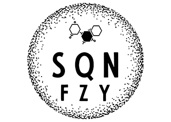

<p align="center">
  
</p>

# Analysis of DNA Sequences

Inspired by [University of Alberta, Paul Stothard's Sequence Manipulation Suite](https://www.bioinformatics.org/sms2/index.html) and [Seqan3](https://github.com/seqan/seqan3) a small bioinformatics library written in C++ to approximately find parts of DNA sequences that can be easily mutated into a useful restriction site. Currently this project is not open source.

# Usage

Initialization of sequences from string can be accomplished by assignment to a Sequence<Tp> instance with the given DNA or RNA sequence type.
```c
sqn::Sequence<Dna5> randGenome = "CTTTACAGGCCCCGGTTTCT";
sqn::Sequence<Dna5> enzymeEagI = "CGGCCG";
```

Initialization of the fuzzy query with genome (haystack) and enzyme (needle) according to their DNA or RNA sequence type.
```c
sqn::FuzzyQuery<Dna5Sequence> query = { randGenome, enzymeEagI };
```
